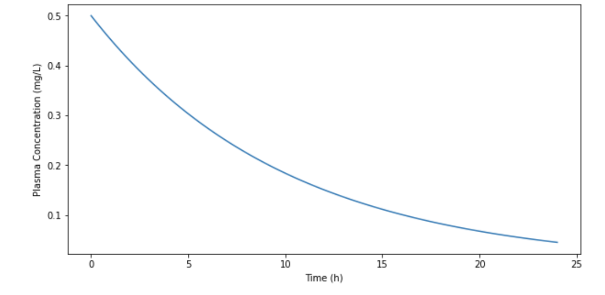
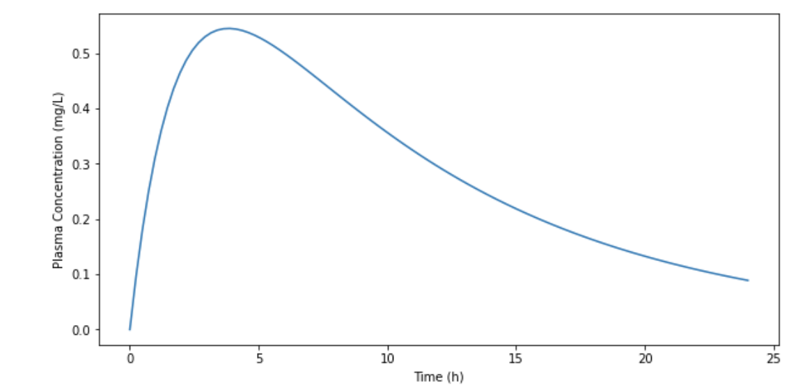
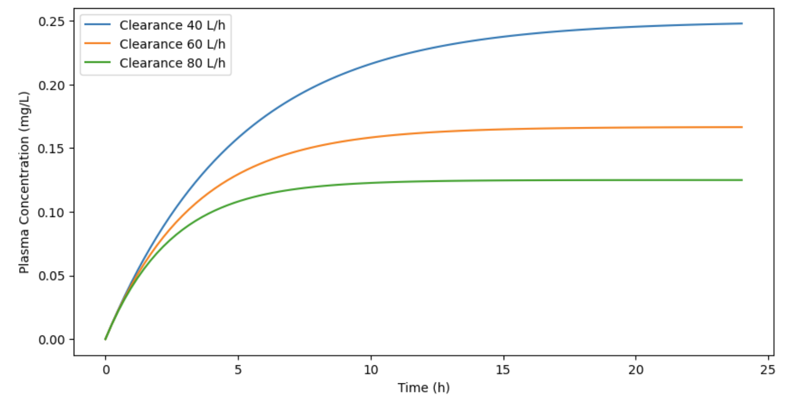
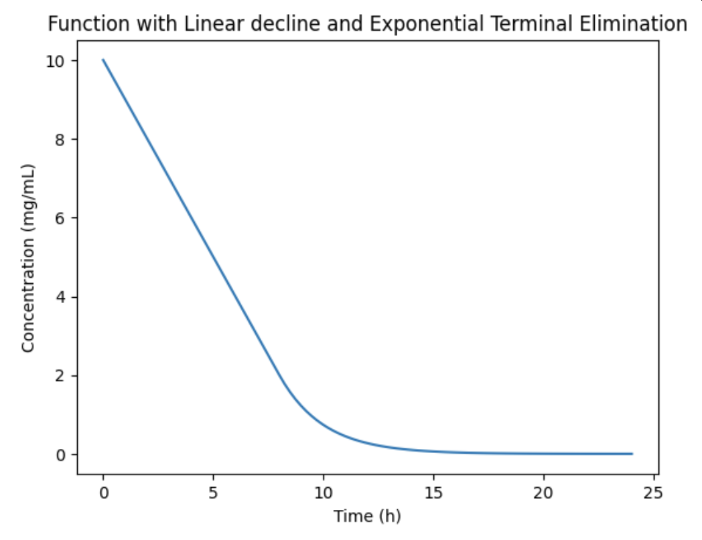
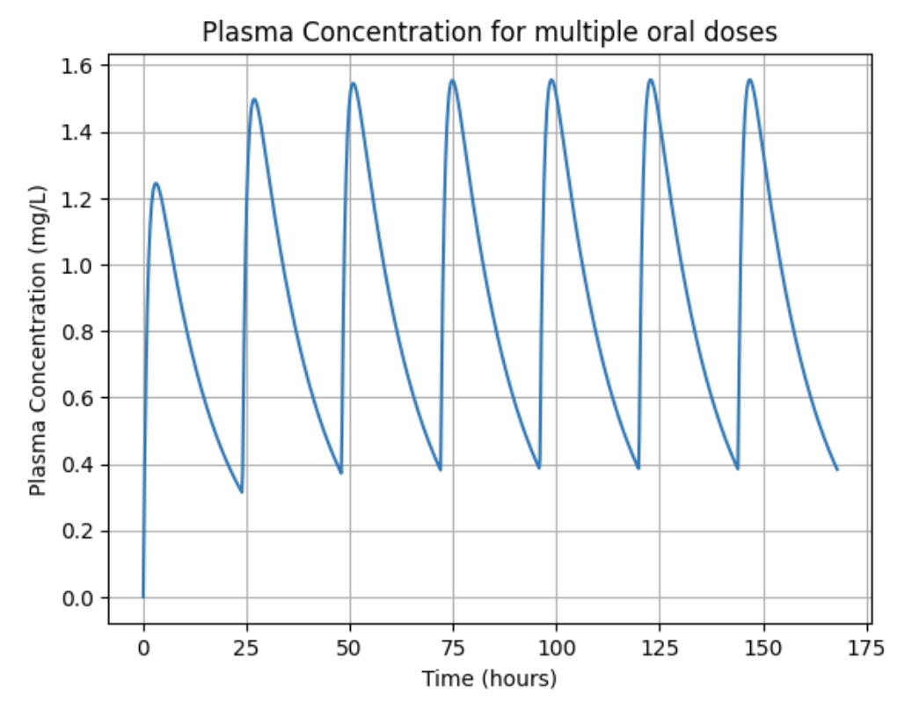

# PK_calcs
PK calculations in Python

## Single IV Dosing
The simplest model is of first order elimination following a single IV dose since we only have to consider the elimination process and we start with all the drug in the blood. There are many assumptions in all PK models and it is good to keep that in mind. You may ask "How is it possible that a given drug is guaranteed to behave in this way?" and you'd be right! There are many variables to consider. Gut metabolism, proportion of the molecule in salt form, hepatic extraction ratio. But for now, start with the single IV dose and you will begin to understand the most critical relationships between PK parameters used in drug design and clinical descision making.

Click the "Open in Colab" button below to open an easy to use Python-based implementation of the single IV dose plasma-time curve formula. Here you will be able to change the parameters of the single IV plasma-time curve and see how they change the curve behavior.

## Oral Dosing Plasma-time Curve
After a while thinking deeply about the single IV plasma-time curve you will be ready to think about the more general but more complicated single oral dose plasma-time curve. This is the simplest situation since you can then introduce multiple doses and also consider other factors affecting drug disposition.

Click the "Open in Colab" button below to open an easy to use Python-based implementation of the Single Oral dose plasma-time curve formula. Here you will be able to change the parameters of the Single Oral dose plasma-time curve and see how they change the curve behavior.

)

## Intravenous Infusion and Effect of Clearance
In these IV infusion cruves you can see the effect of different values of clearance on the steady state concentration of a drug. So drugs that have different clearance values that are dosed at the same mg/hour dose rate will settle at different steady state concentrations.

)

## Non-linear Pharmacokinetics - Initial Zero Order followed by First Order Elimination
This last curve shows what happens when the elimination pathway is saturated initially and then, when to plasma concentration sinks low enough, the elimination returns to first order and starts to slow down. Notice that the curve is linear and then exponential at the end. So the elimination rate is constant at the begining, irrespective of plasma concentration. Then, in the last part of the curve, the elimination rate is proportional to plasma concentration. For simplicity we start with the drug at some concentration at time=0 but if we were considering an oral dose the situation would be far more complicated!

)

## Multiple Oral Dosing
Finally we consider multiple oral dosing. This is a much more difficult thing to work with because there are several variables to consider when plotting the resultant plasma-time curve.

[Multiple Oral Dosing](MultipleOralDose.ipynb)
)
